# School District Analysis

## Overview of School District Analysis

The purpose of this analysis was to take a CSV of students in a disctrict, and a CSV of the schools in that district and run data for the school board. Using Pandas in Python, we were able to use both CSV's, and were able to split up the school information many different ways. This allowed us to run a thorough study and come up with multiple connections between test results and the type of schools the student's attend. 

## Results

Thomas Highschool had dishonest results for their 9th grade class, so we had to clean up the data by removing the 9th graders at THT's results from the data. 
 
### District Summary
* The district summary was only effected by decimal points.
*  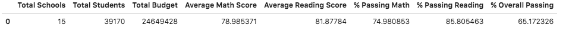
*  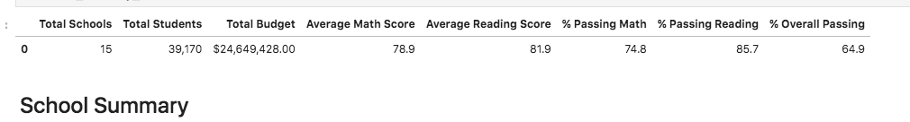

### The School Summary 
* The school summary was barely effected as a result.

* 	The numbers are almost the exact same in both dataframes.

* 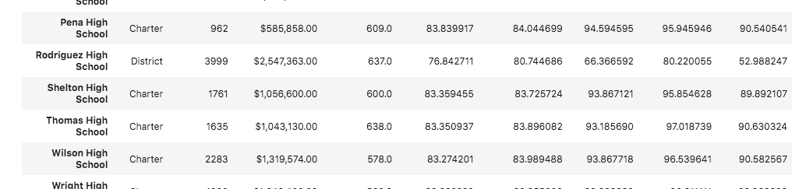

* 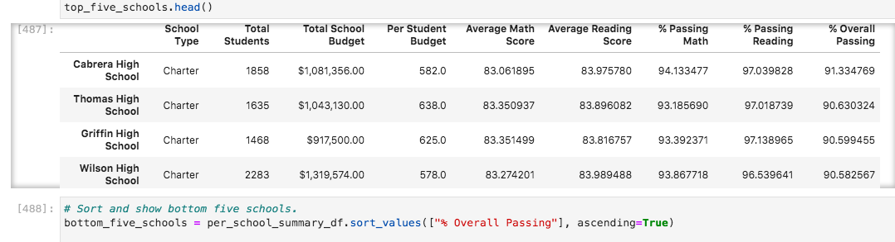

### Effects on Math and Reading
* 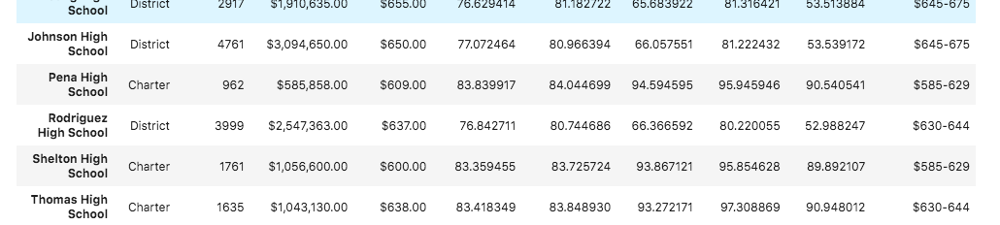
* 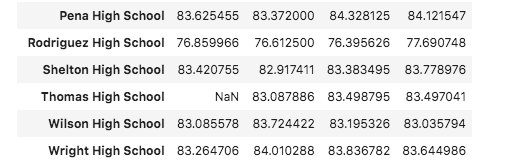
* These graphs show that Thomas HighSchool's 9th grade class did not change the average by much. The 9th grade class had an average math score of 83.590022. Compared to the other grades at Thomas, getting rid of the 9th grade class doesn't change the data by much. 

### Size of Schools
* 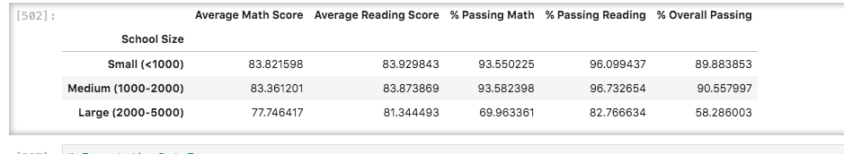
* 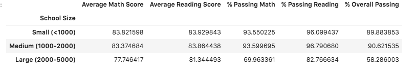
* The bottom graph here is the updated size numbers with getting rid of 9th grader's at THT.
* THT is a medium size school. The numbers change by decimal points. The highest change is in overall passing %, which increased by .7. 

### Schools by Spending 
* 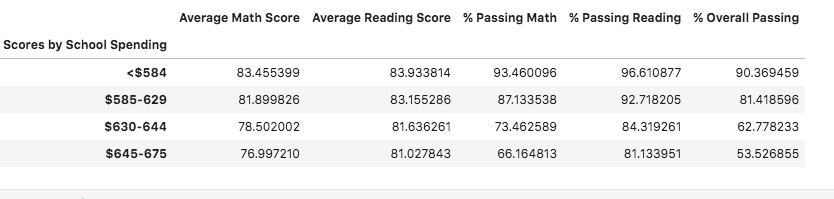
* 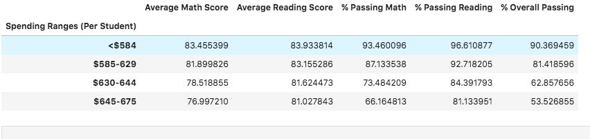
* The scores seperated by school spending show a very small change in the numbers within the $630-644 range. 

### Schools by Type
* 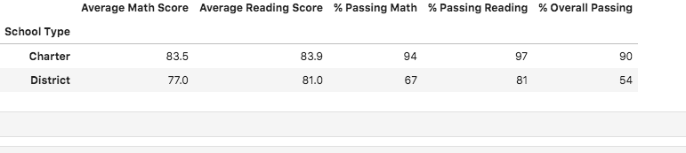
* 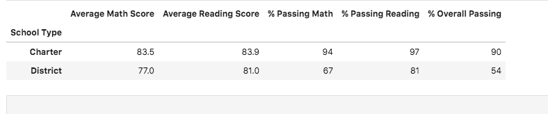
The schools by type chart show very small change. To see the change, you would need to look at the graphs that are not rounded to just the first decimal point. 

### Summary
* Overall, the updated numbers that take out THT's 9th grade class does very little to the overall data. All of the changes are within decimal points. 
* Another change in the data shows that schools within the $630-644 range % overall passing declined by .08.
* We also see a slight increase of .7 in the overall passing percent of medium sized schools.
* The final change to the data is a slight change in the average of all the filtered charts. It was suprising how little the effect was when we took out the data. It make sense, however. With so many students and schools in the district, getting rid of one grade in one medium sized school shouldn't skew the data dramatically.